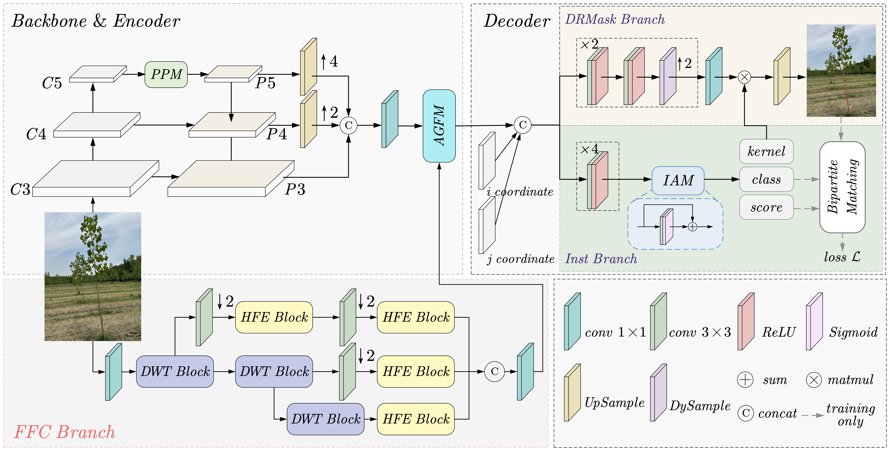
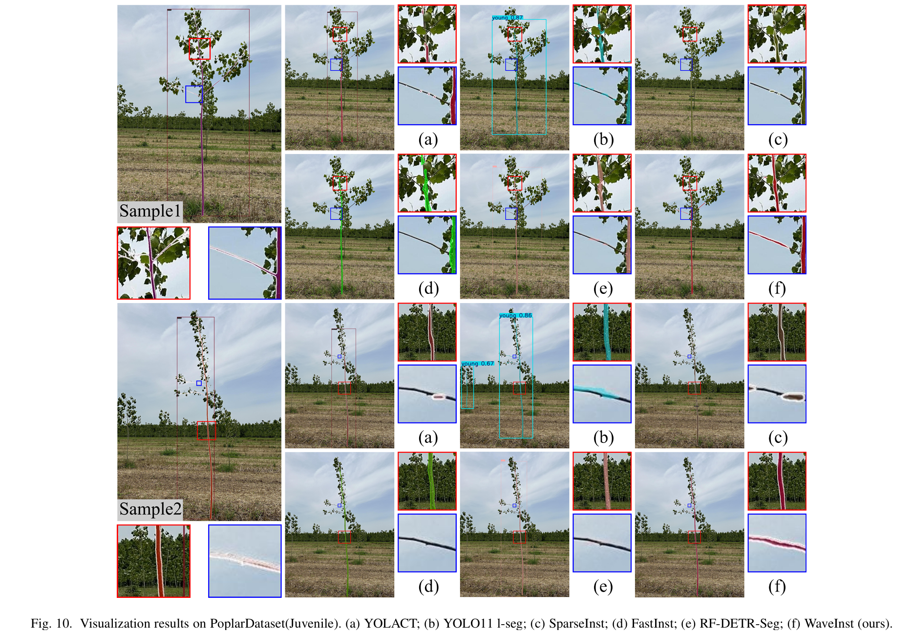
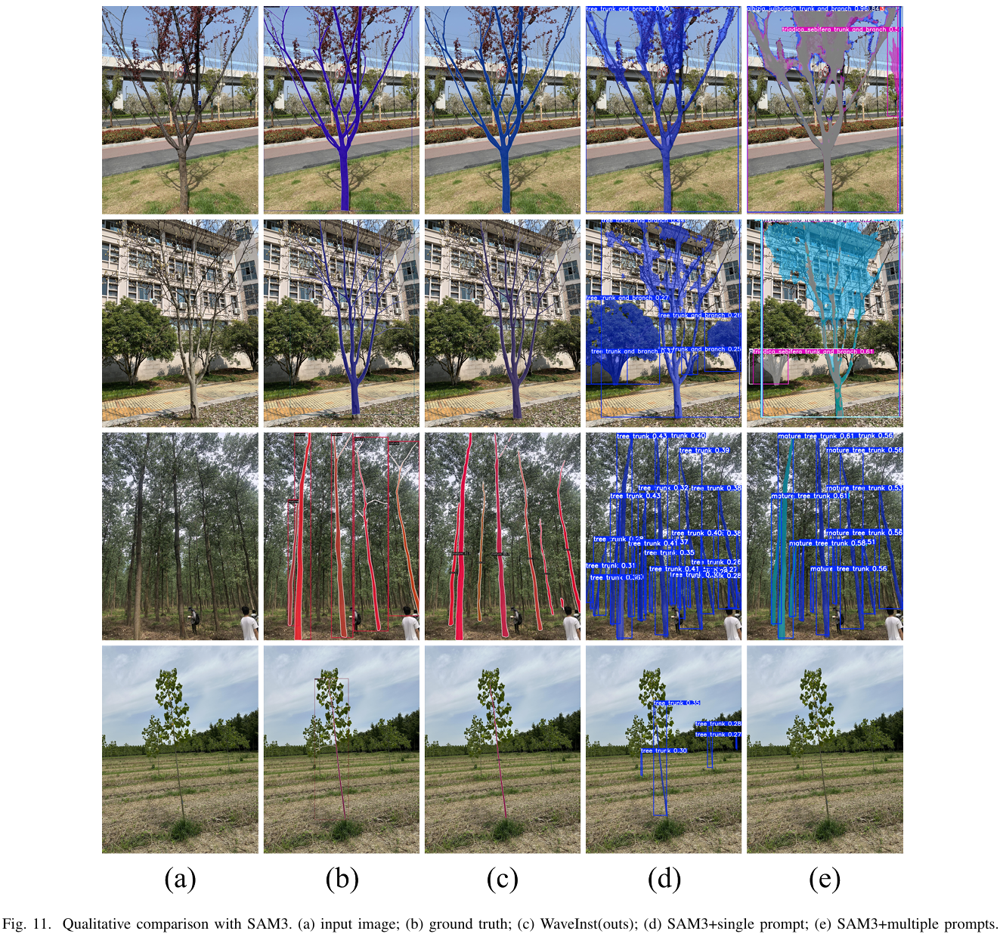

# WaveInst: A Frequency-Domain Enhanced Network for Fine-Grained Thin Tree Trunk Extraction in Forest Scenes

## Overview

WaveInst consists of four main components: the backbone, the encoder, the decoder, and a Frequency-domain Feature Compensation (FFC) branch. The FFC branch is composed of a Discrete Wavelet Transformation (DWT) Block and a High-Frequency Enhancement (HFE) Block. The encoder aggregates multi-scale features extracted by the backbone through a Feature Pyramid Network (FPN) and utilizes the proposed Adaptive Gated Fusion Module (AGFM) to adaptively fuse semantic and frequency-domain information. The decoder employs CoordConv and a decoupled dual-branch design: the DRMask branch reconstructs fine spatial details and generates segmentation masks, while the Inst branch discriminates instances and refines instance-level predictions. Finally, a bipartite matching mechanism ensures precise supervision for accurate instance segmentation.

<center>

</center>

## Demos

We compare WaveInst with several methods on juvenile tree segmentation. In the trunk region, WaveInst produces more complete masks and finer details than YOLACT, YOLO11l-seg, SparseInst, FastInst, and RF-DETR-Seg. For fine branches, only WaveInst successfully segments them, whereas other methods fail. Although WaveInst does not fully connect the fine branches to the main trunk, its overall performance surpasses RF-DETR-Seg, demonstrating superior precision and detail handling.

<center>

</center>

We also evaluate WaveInst against the SAM3 foundation model. With single prompt, SAM3 can segment tree regions but cannot distinguish growth stages or tree species. Using multiple prompts to specify categories results in mask errors, overlaps, and unstable performance, making it difficult to differentiate classes. Overall, WaveInst provides more accurate and fine-grained segmentation results across different datasets.

<center>

</center>

## Installation and Prerequisites

This project is built upon the excellent framework [mmdetection](https://github.com/open-mmlab/mmdetection), and you should install mmdetection first, please check [official installation guide](https://mmdetection.readthedocs.io/en/latest/get_started.html) for more details. 

**Note:** When installing mmdetection, make sure to choose the build from source option for development. Our experiments were conducted using mmcv==2.0.0rc4 and mmdet==3.3.0.

step0: Create a new conda environment and install the PyTorch (CUDA11.8) stack.

```bash
conda create -n wave python=3.8 -y
conda activate wave
pip install torch==2.0.0+cu118 torchvision==0.15.1+cu118 torchaudio==2.0.1+cu118 --index-url https://download.pytorch.org/whl/cu118
```

step1: Insall [MMEngine](https://github.com/open-mmlab/mmengine) and [MMCV](https://github.com/open-mmlab/mmcv).

```bash
pip install mmengine
pip install mmcv==2.0.0rc4
```

step2: Build [MMDetection](https://github.com/open-mmlab/mmdetection) and integrate the WaveInst project.

```bash
git clone --branch v3.3.0 https://github.com/open-mmlab/mmdetection.git
cd mmdetection/projects
git clone https://github.com/fancy-dawn/WaveInst.git
cd ..
pip install -v -e .
```

## Pre-trained Weights

[SynthTree43k](https://github.com/norlab-ulaval/PercepTreeV1) is proposed to address the lack of large-scale annotated datasets for forest environments, aiming to include as many realistic conditions as possible while avoiding manual annotation. The dataset consists of over 43k synthetic images—40k for training, 1k for validation, and 2k for testing—along with more than 190k annotated trees, generated using the Unity engine to simulate diverse tree models, environmental conditions, and lighting variations. Each image is annotated with bounding boxes, segmentation masks, and keypoints, providing comprehensive data for forest-related vision tasks.

You can download our pre-trained weights on this model from the following link: [Baidu Netdisk](https://pan.baidu.com/s/1XKOgKN8xxwZe-z8nBM9muw?pwd=wyfq).

## Acknowledgements

WaveInst is based on [SparseInst](https://github.com/hustvl/SparseInst), [MMDetection](https://github.com/open-mmlab/mmdetection), [SynthTree43k](https://github.com/norlab-ulaval/PercepTreeV1), and we sincerely thanks for their code and contribution to the community!

## License

WaveInst is released under the [MIT Licence](LICENCE).